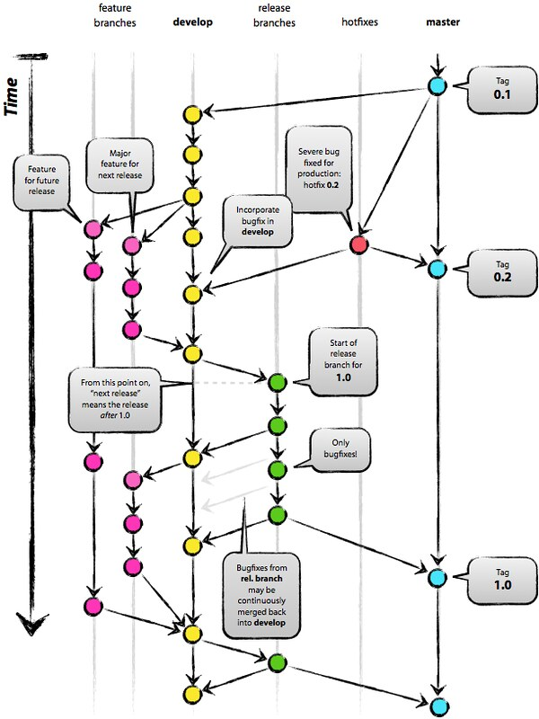

<h1>:star: GIT Flow</h1>

<h3>:scroll: Description</h3>

The purpose of the repository is to work using the git flow.

    
    Git Flow

<h3>:scroll: Branch's</h3>

* feature
* develop
* release
* hotfix
* master